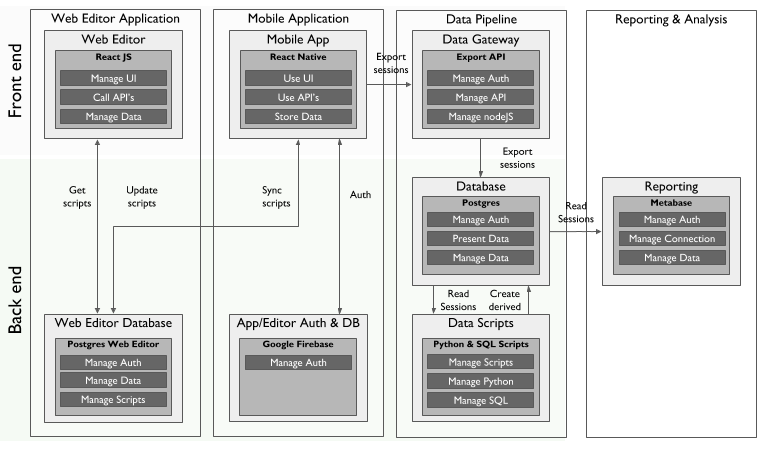

# NeoTree

The NeoTree is an open source platform for improving neonatal care in low-resource settings. 

## Overview of the NeoTree

The NeoTree platform provides the following functions:

* Data capture at the bedside
* Clinical diagnostic and management support
* Data linkage to local clinical data dashboards

In addition we are currently working on data integration to national aggregate data systems.

The technology consists of different services. Source code for each service is stored in separate Github repositories:

1. [The NeoTree Web Editor](https://github.com/neotree/neotree-editor). This is an application that clinicians can use to customize each script i.e. what questions, prompts and data is collected when a patient is admitted, discharged etc. The scripts with the configuration information are stored in the NeoTree backend (see below).
2. [The NeoTree Mobile App](https://github.com/neotree/neotree-android-app). This application is run on Android tablets and mobile phones in the Neonatal wards and is used by Health Care Workers to guide workflow and data capture when patients are admitted and discharged. In addition, the app is also used to record lab results. Each workflow (e.g. for "admission" or "discharge" is determined via a "script", which can be customized via the web editor. (See below.) This means that the app can quickly be adapted in different environments. The app is designed to work with low or no connectivity: connectivity is only required to sync scripts (if e.g. an admission or discharge form has been updated) and post data to the backend.
3. [The NeoTree backend](https://github.com/neotree/node-api). The backend stores consists of a database and an API for managing the flow of data from the front end to the database. The database stores two types of data:
  * The script configuration information. This data is customized in the webeditor, and determines what information, question and data is collected through the different workflows. (Admission, discharge etc.)
  * The actual data posted from the app when e.g. a baby is admitted or discharged.
4. [The NeoTree Data Pipeline](https://github.com/neotree/neotree-data-pipeline). This takes the data in the database collected from the app and reshapes it into a format that makes it easier to visualize and dashboard, to serve back to staff in hospital and integrate with aggregate data systems. 

## Setting up the NeoTree Platform

[TO WRITE]
